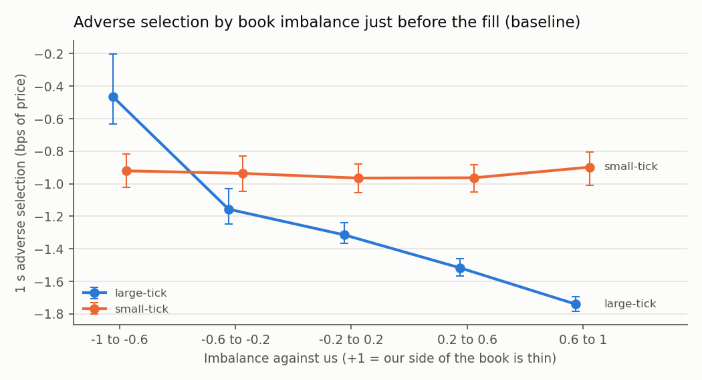

# Nasdaq ITCH Order Book Engine & Market-Making Backtester

A C++20 engine that rebuilds every Nasdaq order book from raw TotalView-ITCH 5.0 data, and a queue-aware simulator for testing market-making strategies on it. An independent Python implementation checks the C++ results.

- **Fast:** reconstructs a full trading day for all 8,713 securities (368M messages) at **13.9M msg/s**, p99.9 **582 ns** per update, **4.3×** faster than a standard-container baseline.
- **Verified:** every optimized variant reproduces the baseline's top-of-book stream exactly, and so does the Python implementation (checked by checksum). Integrity checks run over full days, and CI runs on every push.
- **Research:** found, then confirmed out of sample with a [pre-registered test](results/m5/confirmation_plan.md), that order-book imbalance predicts adverse selection only in **large-tick** stocks.

## Performance

Full day, 2019-01-30, all stocks. Windows 11 / MSVC, i9-13900HX pinned to one performance core, data in memory.

| Order book design | M msg/s | p50 | p99.9 | Memory |
|---|---:|---:|---:|---:|
| `std::unordered_map` + `std::map` (baseline) | 3.3 | 287 ns | 1,430 ns | 353 MB |
| Order pool + open-addressing hash + sorted-vector levels | 9.4 | 125 ns | 548 ns | 226 MB |
| Order pool + direct ref index + sorted-vector levels | **13.9** | 62 ns | 582 ns | 2.5 GB |

The best design depends on the workload. The direct index wins on the full feed but is 5× slower than the hash on a two-stock file, because order refs are numbered across the whole market (measured with cachegrind: 65× more misses to RAM). Details, the gcc cross-check, and cache analysis: [results/bench/](results/bench/).

## Research

A 100-share market maker was simulated on 8 Nasdaq stocks, with queue position, 10 µs latency and post-only orders. Parameters were tuned on one day and results reported on held-out days.

- Joining the best bid and ask loses money before fees: adverse selection (−1.01 ¢/share within 1 s) exceeds the spread captured (+0.66 ¢).
- Within each stock, fills when our side of the book is thin are **1.1 bps more adverse** in large-tick stocks (95% CI 1.0–1.3 on fresh days), with no effect in small-tick stocks. Pooling stocks in cents per share hides this (Simpson's paradox).
- An imbalance filter captures only a small part of that signal (+0.026 bps). Inventory skew cuts inventory risk by 76%.



Full report: [results/m5/report.md](results/m5/report.md) · confirmation: [results/m5/confirmation.md](results/m5/confirmation.md). Caveats: no market impact, Nasdaq only, no fees or rebates, 7 days of data (Nasdaq's full public set).

## Roadmap

- [ ] Measure whether adverse fills and book thinning happen in the same event
- [ ] Exact queue-position model using order-ID ordering
- [ ] Maker-taker fees and rebates in the PnL
- [ ] UDP multicast feed handler (MoldUDP64) with gap recovery and wire-to-book latency
- [ ] Learned short-horizon signal for quote placement

## Build and run

Requires CMake ≥ 3.28, Ninja and a C++20 compiler (MSVC or gcc). Data: free daily files from [Nasdaq](https://emi.nasdaq.com/ITCH/Nasdaq%20ITCH/) go in `data/`. Tests use a small committed fixture.

```sh
cmake --preset release && cmake --build --preset release && ctest --preset release
./build/release/build_book data/01302019.NASDAQ_ITCH50.gz AAPL       # top-of-book stream
./build/release/backtest data/filtered/01302019_universe.itch.gz --symbols AAPL,MSFT --out fills.csv
python scripts/run_benchmarks.py full_day                            # benchmarks
pip install -e ".[dev]" && pytest                                    # Python implementation
```

Other tools are `itch_stats`, `itch_dump`, `itch_filter` and `lob_bench`; usage is at the top of each file in [cpp/apps/](cpp/apps/) and [cpp/bench/](cpp/bench/). Design notes and the full log of findings are in [PLAN.md](PLAN.md).
