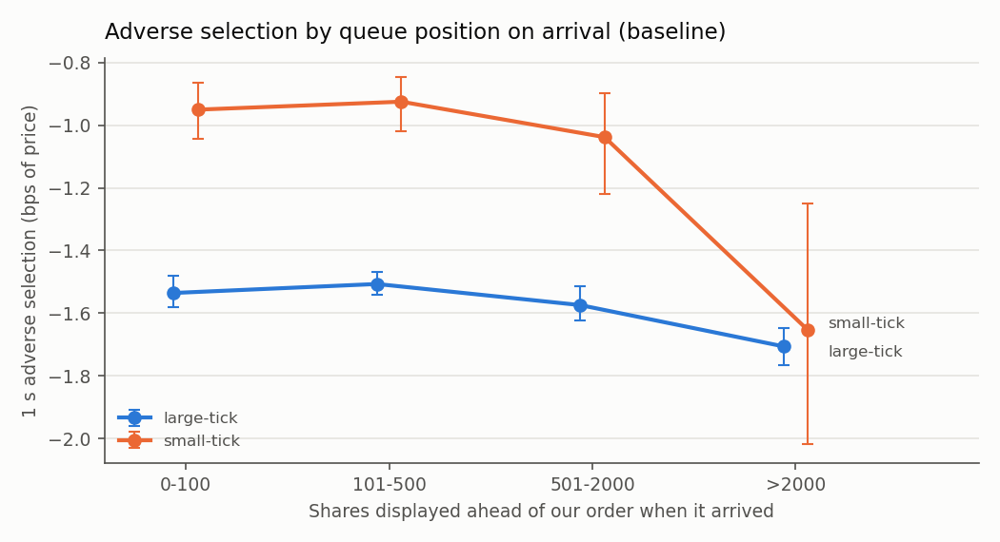
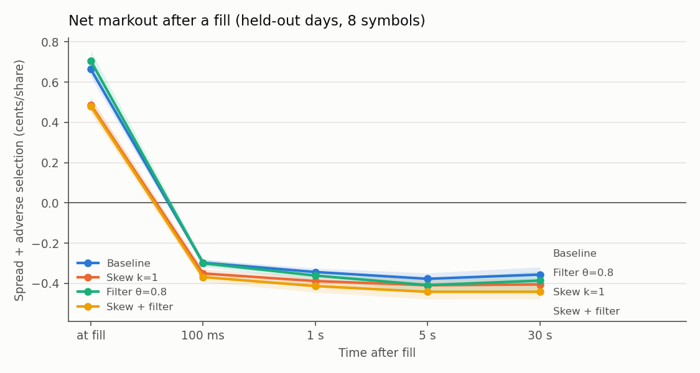
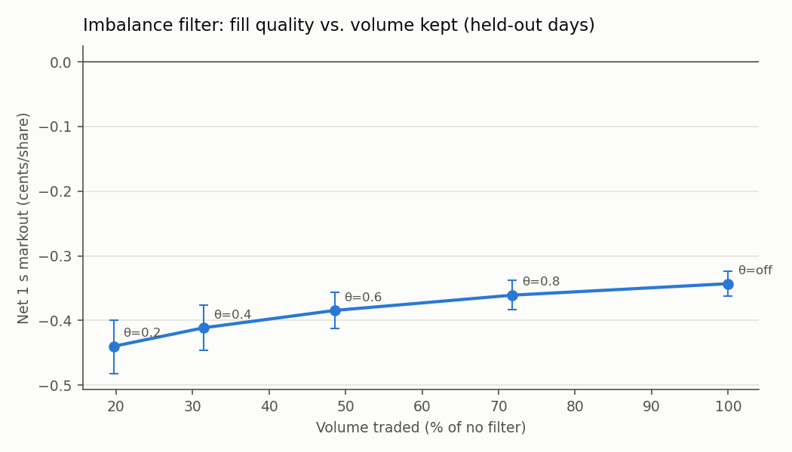

# M5: market-making experiments

Tuning day: 01302019. Held-out days: 03272019, 07302019, 10302019. Symbols: AAPL MSFT AMD INTC CSCO CMCSA NVDA FB.
Defaults: 100-share quotes, max position 500, 10 us latency, proportional cancel model, no fees or rebates.
Cents per share are share-weighted. *Spread* = captured spread vs. the mid just before the fill. *AS h* = how far the mid moved in our favor (positive) or against us (negative) h after the fill. *Net h* = spread + AS h. *Inventory RMS* = time-weighted root-mean-square position, shares. Brackets: 95% block-bootstrap intervals over (day, symbol, 30-minute) blocks, 2,000 resamples.

## 1. Parameter selection on the tuning day

Rules fixed in advance: θ\* maximizes net 1 s markout per share among thresholds keeping ≥ 25% of baseline volume; k\* minimizes inventory RMS among skews whose net 1 s markout is within 0.1 ¢ of the baseline's.
Selected: **θ\* = 0.8**, **k\* = 1**.

| k | θ | Shares (M) | Spread ¢ | AS 1 s ¢ | Net 1 s ¢ | Inventory RMS |
|---|---:|---:|---:|---:|---:|---:|
| 0 | off | 5.87 | 0.710 | -0.941 | -0.230 | 294 |
| 0 | 0.8 | 4.27 | 0.743 | -0.984 | -0.241 | 300 ← |
| 0 | 0.6 | 2.90 | 0.771 | -1.025 | -0.255 | 316 |
| 0 | 0.4 | 1.92 | 0.804 | -1.067 | -0.263 | 324 |
| 0 | 0.2 | 1.24 | 0.832 | -1.101 | -0.269 | 335 |
| 0.5 | off | 7.15 | 0.578 | -0.842 | -0.264 | 96 |
| 0.5 | 0.8 | 5.44 | 0.589 | -0.862 | -0.273 | 92 |
| 0.5 | 0.6 | 3.89 | 0.600 | -0.883 | -0.283 | 88 |
| 0.5 | 0.4 | 2.68 | 0.620 | -0.907 | -0.286 | 87 |
| 0.5 | 0.2 | 1.78 | 0.640 | -0.943 | -0.303 | 86 |
| 1 | off | 7.35 | 0.515 | -0.797 | -0.282 | 72 ← |
| 1 | 0.8 | 5.73 | 0.513 | -0.803 | -0.290 | 69 |
| 1 | 0.6 | 4.18 | 0.515 | -0.816 | -0.301 | 66 |
| 1 | 0.4 | 2.92 | 0.533 | -0.847 | -0.314 | 63 |
| 1 | 0.2 | 1.96 | 0.550 | -0.870 | -0.320 | 62 |
| 2 | off | 8.31 | 0.368 | -0.718 | -0.350 | 56 |
| 2 | 0.8 | 6.87 | 0.340 | -0.713 | -0.373 | 54 |
| 2 | 0.6 | 5.33 | 0.315 | -0.698 | -0.383 | 54 |
| 2 | 0.4 | 3.87 | 0.310 | -0.711 | -0.401 | 54 |
| 2 | 0.2 | 2.62 | 0.331 | -0.737 | -0.406 | 52 |

## 2. The 2×2 on held-out days

| Strategy | Shares/day (M) | Spread ¢ | AS 1 s ¢ | Net 1 s ¢ | Net 30 s ¢ | Inventory RMS |
|---|---:|---:|---:|---:|---:|---:|
| Baseline | 3.75 | 0.664 [0.625, 0.708] | -1.007 [-1.061, -0.958] | -0.343 [-0.361, -0.324] | -0.356 [-0.399, -0.318] | 291 [288, 295] |
| Skew k=1 | 4.60 | 0.488 [0.457, 0.524] | -0.876 [-0.935, -0.824] | -0.388 [-0.418, -0.360] | -0.405 [-0.437, -0.374] | 70 [69, 71] |
| Filter θ=0.8 | 2.70 | 0.706 [0.663, 0.757] | -1.067 [-1.130, -1.011] | -0.361 [-0.383, -0.338] | -0.386 [-0.440, -0.339] | 298 [294, 303] |
| Skew + filter | 3.69 | 0.480 [0.446, 0.521] | -0.893 [-0.956, -0.836] | -0.413 [-0.444, -0.384] | -0.441 [-0.478, -0.409] | 66 [65, 66] |

Differences vs. baseline (paired bootstrap):

| Strategy | Volume | Δ AS 1 s ¢ | Δ Net 1 s ¢ | Δ Net 30 s ¢ | Δ Inventory RMS |
|---|---:|---:|---:|---:|---:|
| Skew k=1 | +23% | +0.131 [+0.118, +0.144] | -0.045 [-0.065, -0.026] | -0.049 [-0.092, -0.008] | -222 [-225, -218] |
| Filter θ=0.8 | -28% | -0.060 [-0.072, -0.049] | -0.018 [-0.024, -0.011] | -0.030 [-0.052, -0.007] | +7 [+3, +11] |
| Skew + filter | -2% | +0.114 [+0.095, +0.130] | -0.070 [-0.092, -0.050] | -0.086 [-0.132, -0.042] | -226 [-229, -222] |

PnL marked to the 16:00 mid, $ per day across all 8 symbols (bootstrap over the 24 day×symbol units), and the maker rebate per share that would make the net 1 s markout break even:

| Strategy | PnL $/day | Δ vs baseline $/day | Break-even rebate ¢/share |
|---|---:|---:|---:|
| Baseline | -12,885 [-16,436, -9,800] |  | 0.343 |
| Skew k=1 | -18,861 [-25,364, -12,886] | -5,976 [-9,855, -2,249] | 0.388 |
| Filter θ=0.8 | -9,215 [-12,174, -6,582] | +3,671 [+2,642, +4,818] | 0.361 |
| Skew + filter | -16,441 [-22,441, -10,907] | -3,556 [-7,227, -12] | 0.413 |

## 3. Imbalance-filter sweep (held-out days, k = 0)

| θ | Volume vs. off | AS 1 s ¢ | Net 1 s ¢ | Δ Net 1 s ¢ vs. off |
|---|---:|---:|---:|---:|
| off | 100% | -1.007 [-1.058, -0.961] | -0.343 [-0.362, -0.324] | +0.000 [+0.000, +0.000] |
| 0.8 | 72% | -1.067 [-1.126, -1.014] | -0.361 [-0.384, -0.338] | -0.018 [-0.025, -0.011] |
| 0.6 | 49% | -1.147 [-1.218, -1.083] | -0.384 [-0.412, -0.356] | -0.041 [-0.056, -0.028] |
| 0.4 | 31% | -1.227 [-1.308, -1.152] | -0.411 [-0.446, -0.376] | -0.068 [-0.091, -0.046] |
| 0.2 | 20% | -1.303 [-1.400, -1.215] | -0.440 [-0.482, -0.399] | -0.097 [-0.130, -0.064] |

## 4. Inventory-skew sweep (held-out days, filter off)

| k | Shares/day (M) | Inventory RMS | Net 1 s ¢ | Net 30 s ¢ |
|---|---:|---:|---:|---:|
| 0 | 3.75 | 291 [288, 295] | -0.343 [-0.362, -0.326] | -0.356 [-0.396, -0.315] |
| 0.5 | 4.44 | 93 [92, 94] | -0.374 [-0.399, -0.351] | -0.396 [-0.426, -0.370] |
| 1 | 4.60 | 70 [69, 71] | -0.388 [-0.417, -0.361] | -0.405 [-0.437, -0.376] |
| 2 | 5.26 | 55 [54, 56] | -0.433 [-0.470, -0.400] | -0.449 [-0.489, -0.413] |

## 5. Robustness: latency and queue model

Baseline, and the effect of the filter (θ = 0.8) under each setting.

| Setting | Baseline shares/day (M) | Baseline net 1 s ¢ | Baseline AS 1 s ¢ | Filter Δ AS 1 s ¢ | Filter Δ net 1 s ¢ | Filter volume |
|---|---:|---:|---:|---:|---:|---:|
| 0 µs | 3.60 | -0.315 [-0.333, -0.297] | -0.995 [-1.041, -0.952] | -0.046 [-0.059, -0.035] | -0.007 [-0.014, +0.000] | -29% |
| 10 µs (default) | 3.75 | -0.343 [-0.362, -0.326] | -1.007 [-1.062, -0.960] | -0.060 [-0.072, -0.049] | -0.018 [-0.025, -0.011] | -28% |
| 100 µs | 4.06 | -0.406 [-0.428, -0.383] | -0.901 [-0.952, -0.854] | -0.074 [-0.086, -0.064] | -0.026 [-0.033, -0.018] | -28% |
| 10 µs, pessimistic cancels | 2.34 | -0.377 [-0.399, -0.356] | -1.049 [-1.111, -0.994] | -0.108 [-0.127, -0.090] | -0.047 [-0.058, -0.036] | -34% |

## 6. Where adverse selection comes from (baseline fills, held-out days)

Pooled across symbols in cents per share, adverse selection looks *smaller* when our side of the book is thin. That is a composition effect (Simpson's paradox): thin-side fills come mostly from low-priced, thick-book stocks whose moves are small in cents. The tables below compare like with like: basis points of price, computed within each symbol, then averaged with equal weight per symbol, separately for large-tick and small-tick stocks.

Tick-size groups, fixed on the tuning day (median quoted spread at our fills = 1 tick → large-tick): **large-tick**: MSFT, AMD, INTC, CSCO, CMCSA; **small-tick**: AAPL, NVDA, FB.

By top-of-book imbalance just before the fill (+1 = our side was thin):

| Group | Imbalance against us | Symbols | AS 1 s (bps) |
|---|---:|---:|---:|
| large-tick | -1 to -0.6 | 5 | -0.464 [-0.631, -0.201] |
| large-tick | -0.6 to -0.2 | 5 | -1.156 [-1.246, -1.029] |
| large-tick | -0.2 to 0.2 | 5 | -1.314 [-1.365, -1.241] |
| large-tick | 0.2 to 0.6 | 5 | -1.517 [-1.568, -1.460] |
| large-tick | 0.6 to 1 | 5 | -1.740 [-1.785, -1.694] |
| small-tick | -1 to -0.6 | 3 | -0.921 [-1.022, -0.817] |
| small-tick | -0.6 to -0.2 | 3 | -0.936 [-1.048, -0.830] |
| small-tick | -0.2 to 0.2 | 3 | -0.965 [-1.054, -0.879] |
| small-tick | 0.2 to 0.6 | 3 | -0.963 [-1.052, -0.881] |
| small-tick | 0.6 to 1 | 3 | -0.898 [-1.009, -0.804] |

By shares displayed ahead of our order when it arrived:

| Group | Shares ahead | Symbols | AS 1 s (bps) |
|---|---:|---:|---:|
| large-tick | 0-100 | 5 | -1.536 [-1.582, -1.480] |
| large-tick | 101-500 | 5 | -1.507 [-1.540, -1.468] |
| large-tick | 501-2000 | 5 | -1.574 [-1.623, -1.515] |
| large-tick | >2000 | 5 | -1.706 [-1.765, -1.647] |
| small-tick | 0-100 | 3 | -0.950 [-1.044, -0.865] |
| small-tick | 101-500 | 3 | -0.925 [-1.019, -0.845] |
| small-tick | 501-2000 | 3 | -1.038 [-1.219, -0.897] |
| small-tick | >2000 | 3 | -1.654 [-2.018, -1.249] |

For reference, the misleading pooled version (cents per share, all symbols together):

| Imbalance against us | Shares (M) | AS 1 s ¢ |
|---|---:|---:|
| -1 to -0.6 | 0.58 | -1.168 [-1.311, -1.016] |
| -0.6 to -0.2 | 0.97 | -1.026 [-1.114, -0.941] |
| -0.2 to 0.2 | 2.08 | -1.085 [-1.162, -1.008] |
| 0.2 to 0.6 | 3.34 | -1.026 [-1.076, -0.978] |
| 0.6 to 1 | 4.28 | -0.928 [-0.952, -0.905] |

## 7. Exploratory: the filter (θ = 0.8) by stock and tick size

**Post hoc**: this split was looked for after seeing the held-out results, so treat it as a hypothesis to confirm on new days, not as a finding. Positive Δ = the filter improves fills.

| Stock / group | Tick size | Volume kept | Baseline net 1 s ¢ | Filter Δ AS 1 s ¢ | Filter Δ net 1 s ¢ |
|---|---:|---:|---:|---:|---:|
| MSFT | large-tick | 79% | -0.341 [-0.370, -0.311] | -0.015 [-0.024, -0.007] | -0.001 [-0.010, +0.007] |
| AMD | large-tick | 55% | -0.259 [-0.283, -0.229] | -0.004 [-0.017, +0.015] | +0.011 [-0.002, +0.029] |
| INTC | large-tick | 60% | -0.285 [-0.310, -0.257] | +0.009 [-0.006, +0.026] | +0.027 [+0.014, +0.042] |
| CSCO | large-tick | 55% | -0.244 [-0.262, -0.224] | +0.012 [-0.009, +0.033] | +0.036 [+0.018, +0.056] |
| CMCSA | large-tick | 66% | -0.240 [-0.265, -0.215] | -0.008 [-0.027, +0.009] | +0.007 [-0.012, +0.025] |
| AAPL | small-tick | 87% | -0.411 [-0.459, -0.355] | -0.015 [-0.027, -0.002] | -0.009 [-0.020, +0.003] |
| NVDA | small-tick | 85% | -0.491 [-0.641, -0.335] | -0.079 [-0.143, -0.024] | -0.053 [-0.103, -0.005] |
| FB | small-tick | 82% | -0.517 [-0.567, -0.470] | -0.050 [-0.071, -0.030] | -0.046 [-0.070, -0.025] |
| all large-tick |  | 65% | -0.287 [-0.301, -0.272] | -0.012 [-0.019, -0.005] | +0.005 [-0.001, +0.012] |
| all small-tick |  | 86% | -0.454 [-0.491, -0.415] | -0.028 [-0.040, -0.015] | -0.024 [-0.036, -0.014] |

## Figures

